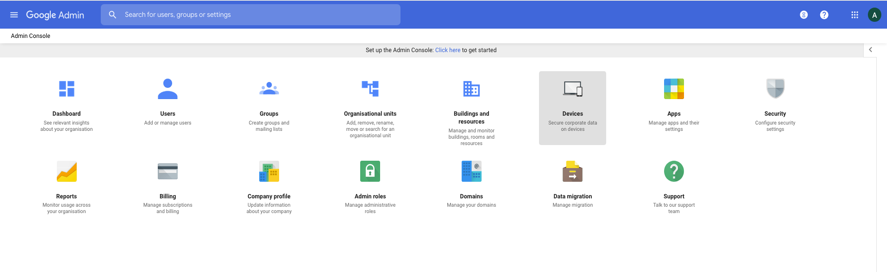
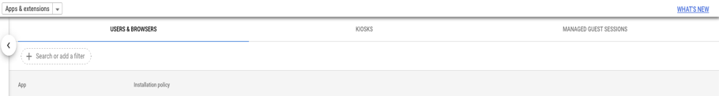

# ChromeOS Policy Documentation

## Getting Started

This guide provides instructions on howto setup and go about managing the "chrome-enterprise-tab-rotate" extension on managed Chrome OS devices.

### Prerequisites

In order to enroll devices, configure settings and most importantly: 'apply policies to users and devices running Chrome OS', you'll need:

* The "Chrome Enterprise Upgrade" in order to manage standalone devices running Chrome OS from the Google Admin console;
* A perpetual upgrade per device you wish to manage.

### Installation

* Open the [Google Admin console](https://admin.google.com)
* Click on *Devices*

* Open *Chrome management* through *Device settings* submenu

* Open *Apps & extensions*

* Select the *Organisational Units* for which you want to deploy the extension/app
* Select the *login type* of your chrome device **users & browsers** or **Managed Guest Sessions** based on your setup

* Select *add from Chrome Web Store* icon in the bottom right corner

* Search for the app *chrome-enterprise-tab-rotate*
* Click on the app to configure the *Policy for extensions*
* Copy-Paste your [configuration](chromeos.sample.json) into the field, and save changes.

### Configuration

An example of the configuration policy can be found [`here`](chromeos.sample.json).

| Setting | Default | Description |
| ------- | ------- | ----------- |
| `autoStart` | `false` | Automatically start rotating tabs after loading the config. |
| `fullscreen` | `false` | Enter fullscreen mode after starting tab rotate. |
| `lazyLoadTabs` | `true` | Open empty tabs and load the website on the first rotation. |
| `websites` | `[]` | Array of `websites` to rotate. |
| `website.url` | `''` | URL to load. |
| `website.duration` | `10` | How long to display the tab in seconds. |
| `website.tabReloadIntervalSeconds` | `60` | Total time in seconds after which the website is reloaded. |
