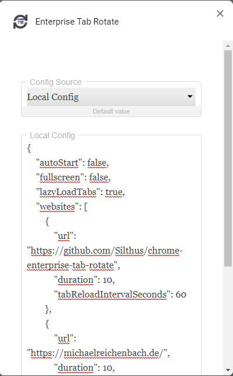

# Local Configuration

To configure the extension locally you need to set the config source type to `local` and provide a valid JSON config.

[]

See the configuration section in the README for a valid [JSON website config](../README.md#Configuration).
