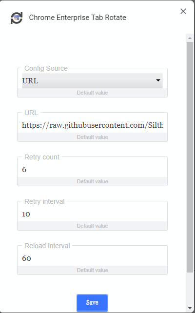

# Remote Configuration

The extension can be configured with a remote config by providing it a URL to a valid [JSON website config](../README.md#Configuration).

Select `URL` as source and point it to a config file, e.g. hosted in Github. See the [`config.sample.json`](config.sample.json) and [`autostart.sample.json`](autostart.sample.json) examples.

[]

Aditionally to the config source you can define some retry and reload values.

| Config | Default | Description |
| ------ | ------- | ----------- |
| Retry count | 6 | How often should the extension try to fetch your remote config until it gives up. |
| Retry interval | 10 | Time to wait in seconds until the remote config is fetched again after an error. |
| Reload interval | 60 | Reload time in seconds. Will only reload the config if it changed. |
